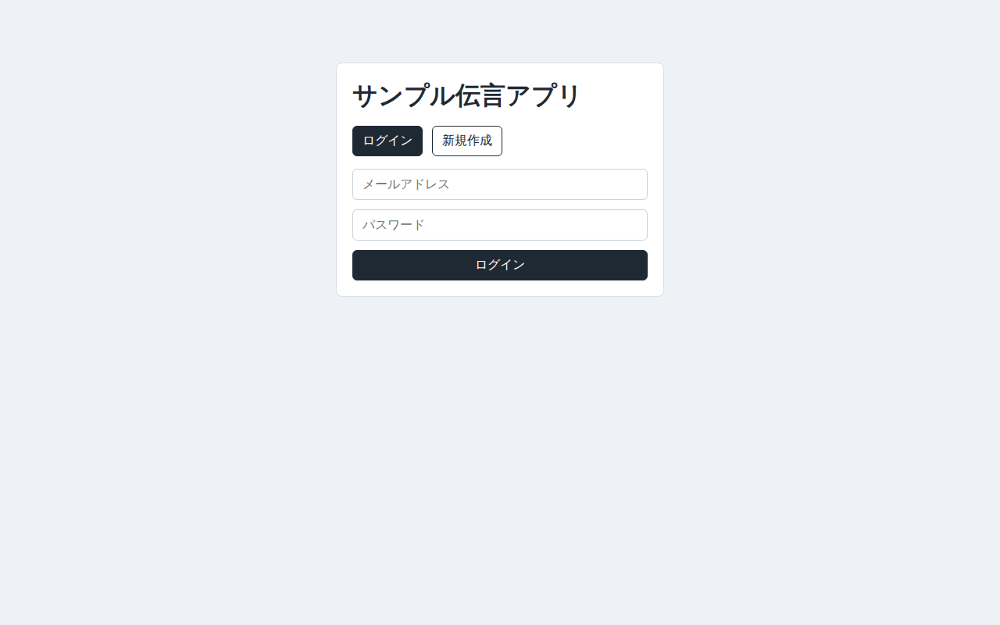
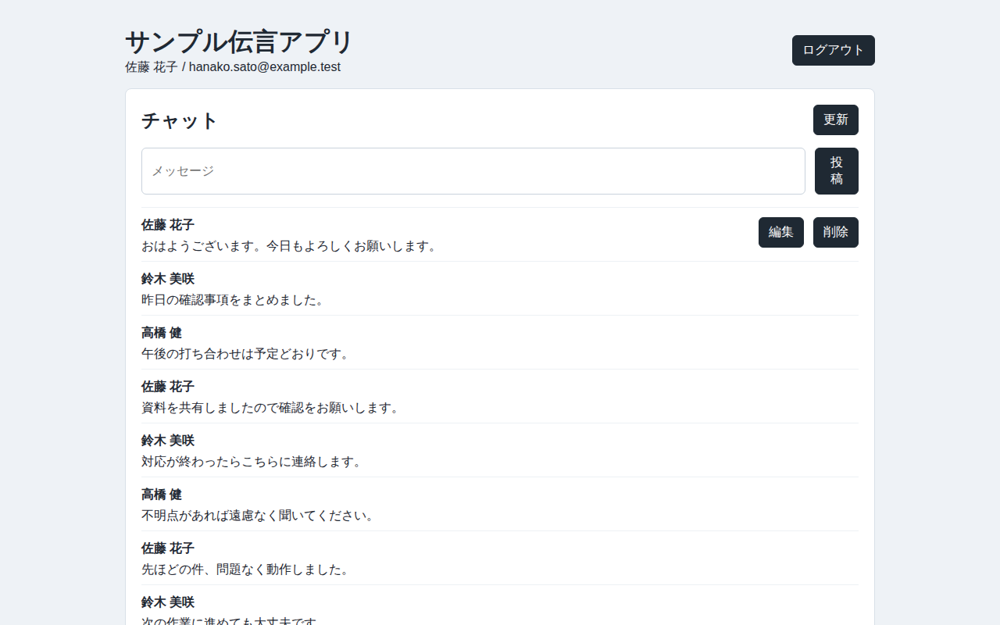
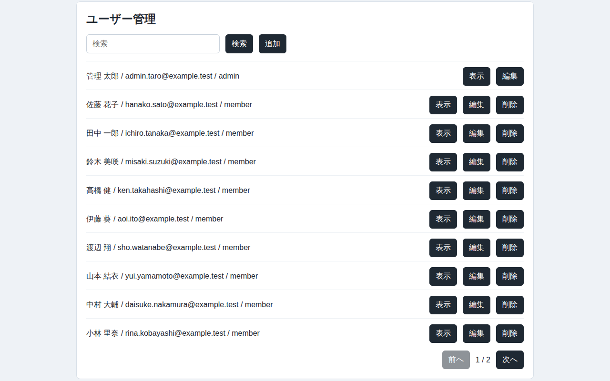

# Sample Message App

React SPA + Ruby on Rails APIで作成した簡易メッセージアプリです。

既存Webサービスの保守・改修案件を想定し、
管理画面機能・CRUD処理・認証機能を中心に実装しています。

PostgreSQLはSupabase Postgresを利用し、Render無料枠で公開する構成です。

## スクリーンショット
### ログイン画面


### 一般ユーザーのチャット画面


### 管理画面


## 公開URL
- App: https://sample-message-app.onrender.com/
- GitHub: https://github.com/half-morrow/sample_message_app

## デモアカウント
公開確認用の管理者アカウントです。

- Email: `admin@example.com`
- Password: `password123`

公開環境の共有アカウントのため、確認時は既存データへの影響が小さい操作に留めてください。

## 想定している案件
- 既存Webサービスの保守・改修
- 認証付きWebアプリの開発
- CRUD機能の追加・改善
- 管理系APIの追加
- React SPAとRails APIを分離した構成の実装

## 主な機能
- ユーザー認証
- メッセージの一覧表示、投稿、編集、削除
- メッセージ一覧の10件ページネーション
- 管理者向けユーザー管理CRUD、検索、ページネーション
- 管理者向けメッセージ管理API

## 技術スタック
### Backend
- Ruby 3.x
- Ruby on Rails 7.x
- Puma
- bcrypt
- rack-cors
### Frontend
- React 19
- Vite 7
### Database
- PostgreSQL
- Supabase Postgres
### Test
-  minitest
- Playwright
### Infrastructure
- Render
- Supabase
- Docker Compose

## 開発時に意識した点
- React SPAとRails APIを分離し、API境界を明確にする
- 認証と管理者権限を含むCRUDを実装する
- Render無料枠とSupabaseを使い、公開時の運用注意をREADMEに残す
- 実運用時の保守性を考慮
- 今後の機能追加を想定した責務分割
- 可読性を意識した実装
- シンプルな構成による運用コスト低減

## 構成
- `backend/`: Rails API
- `frontend/`: React SPA
- `docker-compose.yml`: Docker Compose開発環境

## Dockerでのローカル起動
ホストへRuby/Rails/Node/npm依存を入れずに検証する場合はDocker Composeを使います。Compose project nameはディレクトリ名に合わせて`sample_message_app`に固定しています。

```sh
docker compose build
docker compose run --rm backend bundle install
docker compose run --rm frontend npm install
docker compose run --rm backend bin/rails db:prepare
docker compose run --rm backend bin/rails db:seed
docker compose up
```

- Backend: http://localhost:3000
- Frontend: http://localhost:5173
- DB: Compose内の`db`サービス(PostgreSQL)

ローカルDockerではCompose内DB向けの`LOCAL_DATABASE_URL`を使い、Compose内ではこれをRailsの`DATABASE_URL`へ渡します。ホストや本番向けの`DATABASE_URL`がSupabaseを指していても、ローカルDocker検証には使いません。

`.env.example`の管理者情報はローカルDocker用のダミー値です。実運用の管理者メールアドレス、パスワード、secretはコミット対象に含めないでください。

停止:

```sh
docker compose down
```

依存やDB volumeを破棄して作り直す場合:

```sh
docker compose down -v
docker compose build --no-cache
```

## 通常ローカル起動
### Backend
```sh
cd backend
bundle install
bin/rails db:create db:migrate
bin/rails server
```

### Frontend
```sh
cd frontend
npm install
npm run dev
```

必要に応じて`frontend/.env`にAPI URLを設定します。

```sh
VITE_API_BASE_URL=http://localhost:3000
```

## テスト・ビルド
### Backend test
```sh
cd backend
bin/rails test
```

Dockerで実行する場合:

```sh
docker compose run --rm backend bin/rails test
```

### Frontend build
```sh
cd frontend
npm run build
```

Dockerで実行する場合:

```sh
docker compose run --rm frontend npm run build
```

### Playwright E2E
E2Eはローカル/開発環境専用です。本番URL、本番DB、本番認証情報は使わないでください。

```sh
cd frontend
PLAYWRIGHT_BASE_URL=http://localhost:5173 npm run test:e2e
```

ビジュアルリグレッションテストで差分を確認する場合:

```sh
cd frontend
PLAYWRIGHT_BASE_URL=http://localhost:5173 npm run test:e2e:visual
```

初回または意図したUI変更でsnapshotを更新する場合:

```sh
cd frontend
PLAYWRIGHT_BASE_URL=http://localhost:5173 npm run test:e2e:visual -- --update-snapshots
```

README用スクリーンショットを再生成する場合:

```sh
cd frontend
PLAYWRIGHT_BASE_URL=http://localhost:5173 npm run screenshots:readme
```

Dockerで実行する場合:

```sh
docker compose -f docker-compose.yml -f docker-compose.e2e.yml run --rm frontend npm install
docker compose -f docker-compose.yml -f docker-compose.e2e.yml run --rm backend bin/rails db:prepare
docker compose -f docker-compose.yml -f docker-compose.e2e.yml up -d --build db backend frontend
docker compose -f docker-compose.yml -f docker-compose.e2e.yml run --rm e2e npm run test:e2e
docker compose -f docker-compose.yml -f docker-compose.e2e.yml run --rm e2e npm run test:e2e:visual
```

E2E時はbackendが`sample_message_app_e2e`を使い、frontendはCompose内のbackendへ接続します。通常の開発DBとは分けて扱います。初回はPlaywright公式イメージの取得に時間がかかる場合があります。

停止:

```sh
docker compose -f docker-compose.yml -f docker-compose.e2e.yml down
```

## 環境変数
### Backend
- `DATABASE_URL`: Supabase Postgresの接続URL。実値はRenderなどの環境変数にだけ設定する。
- `FRONTEND_ORIGIN`: React SPAのorigin。例: `https://sample-message-app.onrender.com`
- `SECRET_KEY_BASE`: production用Rails secret
- `ADMIN_EMAIL`: ローカルseedで使う初期管理者メールアドレス。本番必須ではありません。
- `ADMIN_PASSWORD`: ローカルseedで使う初期管理者パスワード。本番必須ではありません。
- `ADMIN_NAME`: ローカルseedで使う初期管理者名。任意。本番必須ではありません。

### Frontend
- `VITE_API_BASE_URL`: Rails APIのbase URL。例: `http://localhost:3000`

環境変数の実値、Supabase接続URL、API key、パスワード、secretはREADME、tasks、`.env`、ログ、チャット、shell historyへ残さないでください。

## Render/Supabaseメモ
- Rails APIはRender Web Serviceに配置する。
- React SPAはRender Static Siteに配置する。
- 永続DBはRender Free PostgresではなくSupabase Postgresを使う。
- Render無料枠ではアイドル後のスリープと初回起動遅延が発生する。
- MVPではリアルタイム更新は行わず、投稿後再取得または手動更新に留める。

### Render backend Web Service
- Root Directory: `backend`
- Runtime: Ruby
- Build Command: `bundle install`
- Pre-deploy Command: 設定しない（Render無料枠では採用手順にしない）
- Start Command: `bundle exec puma -C config/puma.rb`

Buildは依存準備、Startはpuma起動に限定します。Start Commandにはmigrationを含めません。Build Command内migration、Pre-deploy Command、Render Shell、SSH、Dashboard Shell、SQL Editor等での通常migration、CI migration、有料機能は今回の無料枠の通常手順にしません。

必須環境変数:
- `RAILS_ENV=production`
- `RACK_ENV=production`
- `DATABASE_URL`: Supabase pooler session mode URL推奨。実値はRenderのEnvironmentにだけ設定する。
- `SECRET_KEY_BASE`: `bin/rails secret`などで生成したproduction用secret。
- `FRONTEND_ORIGIN`: Render Static Siteのorigin。例: `https://sample-message-app.onrender.com`

`FRONTEND_ORIGIN` はブラウザのOriginと完全一致する必要があります。schemeなし、末尾slash付き、path付きの値はCORS許可originとして一致しません。backend環境変数を変更した後は、Render backend Web Serviceをrestart/redeployして反映します。

本番migrationは、ローカル端末から本番Supabaseへ一時環境変数で接続して実行し、成功後にRender backendをdeploy/redeployします。実行前に対象revisionを最新化し、Supabase project、database名、環境名、pooler session mode/direct connection、SSL要否が意図した本番DB向けであることを確認してください。IPv4/IPv6対応が不明な環境では、migration用の一時`DATABASE_URL`にもSupabase pooler session mode URLを推奨します。direct connectionはIPv6対応を確認できる環境向けの補足です。

```sh
cd backend
read -r -s DATABASE_URL # paste <SUPABASE_DATABASE_URL>
RAILS_ENV=production DATABASE_URL="$DATABASE_URL" bin/rails db:migrate
RAILS_ENV=production DATABASE_URL="$DATABASE_URL" bin/rails db:migrate:status
unset DATABASE_URL
```

Supabase接続URLは用途と実行環境のIPv4/IPv6到達性に合わせて選びます。

- Render backendの`DATABASE_URL`は、Supabase pooler session mode URLを推奨します。実値はRenderのEnvironmentにだけ設定します。
- migration用の一時`DATABASE_URL`も、ローカル端末や実行ネットワークのIPv4/IPv6対応が不明な場合はSupabase pooler session mode URLを推奨します。
- direct connectionはIPv6対応環境から接続できる場合の補足として扱います。Render runtimeや到達性不明のmigration実行元では標準手順にしません。
- pooler transaction modeはprepared statementsの制約があるため、通常のRails migrationでは慎重に扱います。通常手順ではsession modeを優先します。
- 有料IPv4 add-onは無料枠外の将来案です。今回の無料枠手順では採用前提にしません。

IPv6アドレスへの接続で`Network is unreachable`が出た場合は、direct connectionをIPv6非対応環境から使っている可能性を確認してください。断定せず、Render runtimeとmigration実行元の両方で、接続URL種別とIPv6到達性を確認します。

破壊的migrationは別リリースまたは段階的手順として扱ってください。

### Render frontend Static Site
- Root Directory: `frontend`
- Build Command: `npm install && npm run build`
- Publish Directory: `dist`


必須環境変数:
- `VITE_API_BASE_URL`: Render backend Web Serviceのbase URL。例: `https://sample-message-app-1.onrender.com`

`VITE_API_BASE_URL` は末尾slashや `/api` などのpathを含めません。この値はfrontend build時に埋め込まれるため、Render Static Site側で変更した場合はrebuild/redeployして反映します。

### ログイン時にレスポンスが返ってこない場合
まずブラウザDevToolsのNetworkで、`OPTIONS /api/auth/login` と `POST /api/auth/login` の有無を確認します。JSON POSTではpreflightが発生するため、CORSに失敗するとブラウザがレスポンス参照をブロックし、frontendではnetwork errorのように見えることがあります。

確認観点:
- request headerの`Origin`が `https://sample-message-app.onrender.com` のようなscheme付きoriginになっている。
- preflight response headerの`Access-Control-Allow-Origin`がrequestの`Origin`と一致している。
- `VITE_API_BASE_URL` から組み立てられたrequest URLがbackend Web Serviceを向いている。
- preflightが通った後にPOSTが遅い、または500/502/503になる場合は、Render logsでcold start、backend runtime error、DB接続問題を切り分ける。

## 今後の改善
- UI表示や入力エラー表示の改善
- 管理者向け操作の拡充
- E2Eテストケースの追加
- 本番運用手順の継続的な整理
